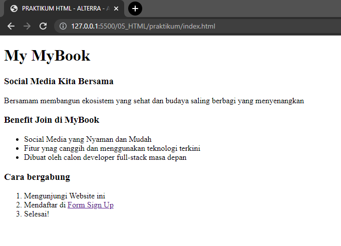
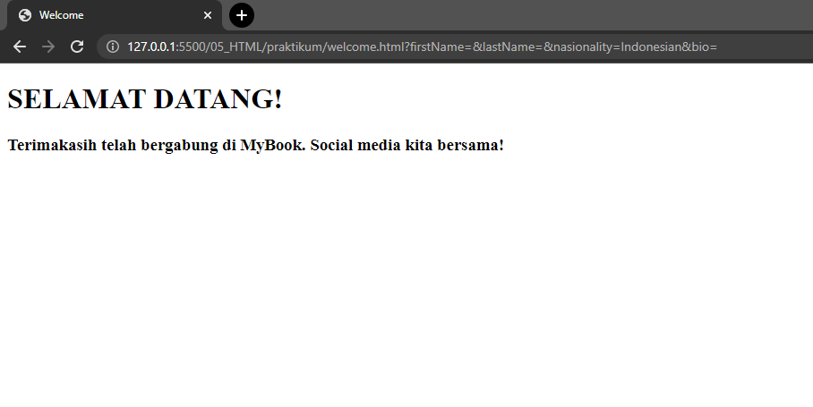

# 05 HTML

## Resume

Dalam materi ini dipelajari:
1. Frontend
2. HTML (Hypertext Markup Language)
3. Tag pada HTML

### Frontend

Frontend adalah bagian pada website yang digunakan untuk memperlihatkan tampilan pada user atau pengguna. Frontend pada website biasanya menggunakan 3 bahasa dasar, yaitu HTML, CSS dan Javascript.

### HTML

HTML (Hypertext Markup Language) adalah bahasa yang digunakan untuk membuat struktur pada website. HTML memiliki ekstensi .html dan bisa langsung dijalankan dengan menggunakan web browser.

HTML juga memiliki berbagai fungsi-fungsi lainnya seperti membuat form, menampilkan gambar, membuat tabel dan mengatur tampilan dari isi halaman web.


### Tag Pada HTML

Dalam penulisan kode program, HTML memiliki berbagai macam tag yang bisa digunakan. Namun, html memiliki tag-tag dasar atau boilerplate yang biasa digunakan pada saat pertama kali dalam membuat website. Adapun boilerplatenya adalah sebagai berikut. 

```
<html>
<head>
    <title>Document</title>
</head>
<body>
    
</body>
</html>
```

Pada boilerplate ini terdapat 4 tag yang digunakan, yaitu html sebagai tag utama pada kode, selanjutnya head sebagai kepalanya, title yang digunakan untuk menampilkan judul website dan body untuk membuat isi dari website.

Selain tag-tag di atas, masih banyak juga tag yang bisa digunakan untuk membuat form,  membuat tulisan paragraf, membuat list, membuat tabel dan masih banyak lagi.

## Praktikum

### 1. Membuat index.html
Praktikum nomor 1 dilakukan pembuatan index html yang digunakan sebagai home page pada sebuah website buku sederhana. Di dalam page ini terdapat link pada huruf sign up yang tersambung ke form page.
   
Berikut kode programnya 
   
[index.html](./praktikum/index.html)
   
Output:
   

   
### 2. Membuat form page
Praktikum nomor 2 membuat form dengan beberapa jenis input, seperti text input, radiobutton, checkbox dan textarea. Pada saat tombol sign up ditekan maka akan tersubmit dan pindah ke welcome page.

Berikut kode programnya 
   
[form.html](./praktikum/form.html)
   
Output:
   


### 3. Membuat welcome page
Praktikum nomor 3 membuat page yang berisi tulisan ketika user sudah menekan tombol sign up pada page form. Pada page ini digunakan tag h1 dan h3.

Berikut kode programnya 
   
[welcome.html](./praktikum/welcome.html)
   
Output:
   


