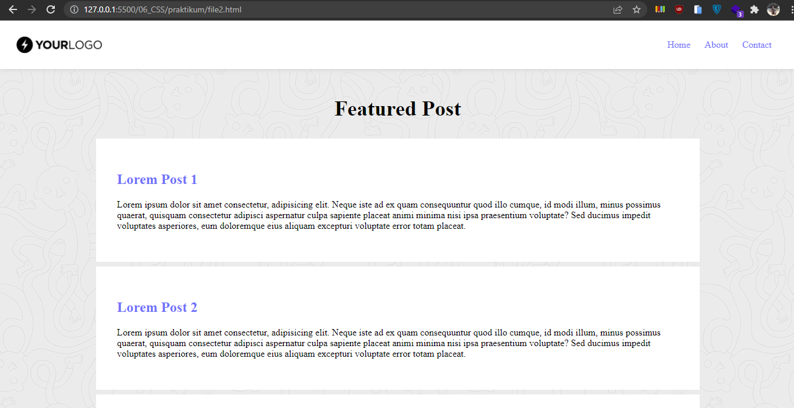
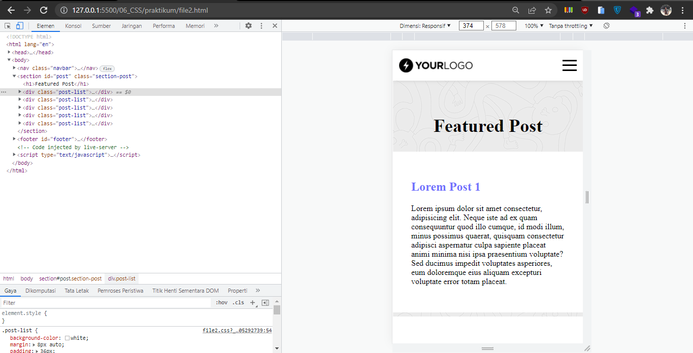
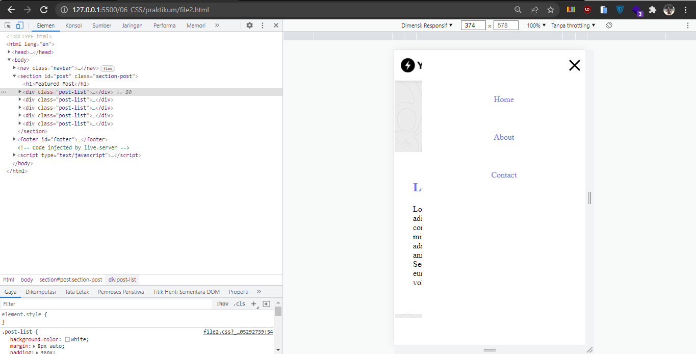

# 06 CSS

## Resume

Dalam materi ini dipelajari:
1. Apa itu CSS
2. CSS Selector
3. CSS Grouping

### Apa itu CSS

CSS (Cascade Style Sheets) adalah bahasa yang digunakan untuk memberikan style atau hiasan pada HTML yang telah dibuat. 

Untuk menambahkan CSS dalam HTML, terdapat 3 cara yang dapat digunakan, yaitu.
1. Inline CSS, ini adalah cara dimana kode CSS dituliskan di dalam elemen tunggal HTMLnya.
2. Internal CSS, ini adalah cara dimana kode CSS dituliskan dalam HTML dengan menggunakan tag HTML style.
3. External CSS, ini adalah cara dimana kode CSS dituliskan di luar file HTML, yaitu dengan menggunakan file .css sendiri. Untuk menggabungkannya menggunakan tag link.

### CSS Selector

CSS Selector adalah cara yang digunakan untuk memilih elemen HTML yang akan diubah stylenya.

Ada dua jenis CSS selector yaitu,
1. id, salah satu css selector yang spesial karena hanya bisa dimiliki oleh satu elemen. Untuk memilihnya menggunakan simbol pagar (#).
2. class, salah satu css selector yang dapat digunakan oleh banyak elemen. Untuk memilihnya menggunakan simbol titik (.).

Dalam memberikan styling pada css, dapat memilih banyak css selector sekaligus. Cara ini disebut dengan CSS Grouping. Untuk memilih banyak selector dapat menggunakan simbol koma (,).

``
.class-1, .class-2 {
    font-size:20px;
}
``

### Macam-Macam Styling Pada CSS

Dalam melakukan styling dengan menggunakan CSS, banyak yang dapat diubah bentuknya, seperti font, background color, margin, padding, display, animasi, posisi dan masih banyak lagi.

## Praktikum

### 1. Membuat Styling pada Box di file1.html
Praktikum nomor 1 dilakukan pembuatan 3 box berdasarkan kode HTML yang diberikan. Dimana masing-masing kotak diberikan styling dan penempatan yang berbeda. box 1 berwarna merah, box 2 berwarna biru dan box 3 berwarna hijau. Selain itu, tulisannya juga menggunakan font Slabo 27px dan font size 20px.

Untuk penempatan masing-masing box dilakukan dengan memberikan position absolute dan menentukan top, left, right atau bottomnya.
   
Untuk menentukan jenis fontnya pertama font disambungkan dengan kode @import url() pada cssnya lalu ditentukan menggunakan font-family.

Berikut kode programnya 
   
[file1.html](./praktikum/file1.html)
   
Output:
   

   
### 2. Membuat Website Blog file2.html
Praktikum nomor 2 membuat website blog yang terdiri dari navbar, section post dan footer dengan menggunakan CSS murni. Selain itu juga dibuat menu responsivenya dengan menggunakan hamburger menu. Untuk membuat link navbarnya digunakan list dengan flexbox.

Pada pembuatan website blog file2 ini, digunakan external CSS. Berikut kode programnya.
   
[file2.html](./praktikum/file2.html)
[file2.css](./praktikum/file2.css)
   
Pada tampilan website, berikut hasilnya.
   

Untuk pembuatan tampilan mobile digunakan media queries untuk menentukan max width viewportnya. Hamburger menu dibuat dengan menggunakan 3 div yang diberikan styling warna hitam dan height 3px sehingga membentuk garis. Berikut tampilan mobilenya.

Ketika tombol menu hamburger ditekan maka akan muncul menu sidebarnya. Supaya hamburger menunya dapat berfungsi, digunakan checkbox sebagai trigger menunya. checkbox diberikan opacity 0, karena yang dibutuhkan hanya fungsinya saja. Pada saat menunya muncul, terdapat animasi yang menggunakan css transition. Selain itu, bentuk hamburger menunya juga berubah pada garis ke 1 dan 3 nya dengan menggunakan transform:rotate, sedangkan pada garis ke 2 nya dihilangkan dengan menggunakan transform:scaleY(0). Berikut tampilan menu sidebarnya.

