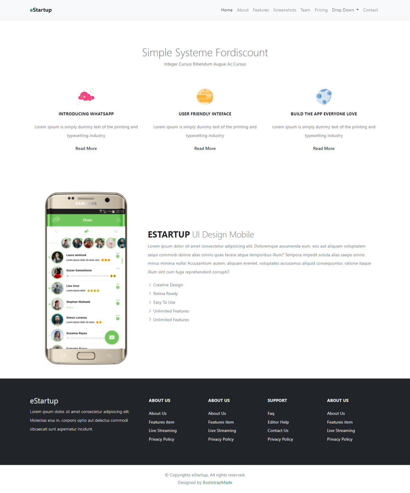

# 07 Bootstrap

## Resume

Dalam materi ini dipelajari:
1. Frontend Framework
2. Bootstrap
3. Grid System Bootstrap

### Frontend Framework

Frontend Framework adalah sekumpulan kode yang telah dibuat oleh seseorang yang dapat digunakan untuk mempermudah dalam membuat tampilan frontend website. Frontend framework memiliki banyak jenis, seperti Bootstrap, TailwindCSS, Materialize dan masih banyak lagi.

### Bootstrap

Bootstrap adalah salah satu frontend framework yang bisa digunakan untuk membuat tampilan website. Pada saat ini, bootstrap sudah mencapai versi 5. Bootstrap memiliki banyak keuntungan dalam penerapannya, yaitu gratis, mudah dipelajari, mendukung tampilan responsive dan cepat.

Bootstrap terdiri dari kumpulan class-class CSS yang siap untuk dipakai di dalam HTML. Selain itu, bootstrap juga menyediakan komponen-komponen siap pakai seperti button, card, slider, modal, navbar dan masih banyak lagi. Ada beberapa cara yang dapat digunakan untuk menggunakan bootstrap dalam projek website. Cara memulainya bisa menggunakan link CDN ataupun download file bootstrap yang tersedia di website dokumentasi bootstrap https://getbootstrap.com/.

### Grid System Bootstrap

Bootstrap memiliki fitur yang dapat mempermudah layouting dalam pembuatan website. Fitur tersebut adalah grid system. Grid system bisa membagi bagian website menjadi beberapa kolom. Untuk menggunakan grid system, perlu class row di dalam parent divnya. Pada child div di dalam class row bisa menggunakan class col-{viewport}-{number}. {viewport} dalam hal ini adalah ukuran layar yang akan diterapkan class tersebut, pilihannya adalah sm, md, lg dan xl. {number} dalam hal ini adalah ukuran kolomnya, dalam 1 row ukuran maksimal kolom adalah 12. Berikut contoh penggunaan grid system dalam bootstrap.

``

    

    <!-- Konten -->
    

    

    <!-- Konten -->
    

``

## Praktikum

Pada praktikum kali ini membuat tampilan website responsive dengan menggunakan bootstrap. Tampilan website terdiri dari pada mode website dan mobile. 

Berikut ini adalah code programnya. 

[index.html](./praktikum/index.html)

Berikut ini adalah screenshot hasil tampilan websitenya.

Berikut ini adalah screenshot hasil tampilan mobilenya.

Pada website ini terdapat 3 bagian utama, yaitu header, body dan footer.

### 1. Membuat Header

Pada header terdapat navbar yang dibuat menggunakan komponen bawaan bootstrap dengan tambahan class me-auto untuk memindahkan menu navbar di bagian kanan.

   
### 2. Membuat Body

Pada bagian body terdapat 2 bagian, bagian pertama menggunakan row yang terbagi menjadi 3 kolom dengan ukuran col-4 di setiap kolomnya. Namun, pada tampilan website hanya ada 1 kolom dalam 1 rownya. Di dalam masing-masing kolomnya terdapat gambar dan penjelasan tulisan yang memiliki font weight yang berbeda-beda.

Pada bagian kedua menggunakan row yang dibagi menjadi 2 kolom dengan ukuran col-lg-4 di sebelah kiri dan col-lg-8 di sebelah kanan. Untuk bagian kiri diisi dengan gambar smartphone yang diberikan w-75 dari containernya, sedangkan bagian kanan diisi dengan penjelasan fitur dan gambar disebelahnya. Pada list di bagian penjelasan gambar, digunakan icon bootstrap arrow-right.

### 3. Membuat Footer

Pada footer berisi link-link yang dapat digunakan untuk ke page lain. Footer diberikan background gelap dengan class bg-dark. Pada 1 row di dalam footernya terdiri dari 5 kolom yang ukuran kolom paling kirinya yaitu 4 dan selanjutnya masing-masing 2. Pada bagian footer kedua yang paling bawah hanya menggunakan tag p saja untuk memberikan tulisan copyright dan span dengan class text-success untuk memberikan warna hijau.

Selain itu, di bagian footer terdapat button untuk move-to-top. Button tersebut dibuat dengan komponen bawaan bootstrap yaitu btn btn-success. Button tersebut memiliki class position fixed sehingga button akan selalu berada di tempat yang sama walaupun websitenya discroll.

