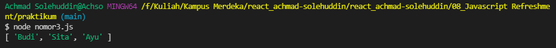
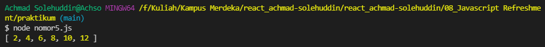

# Praktikum

## Nomor 1.

Berikut adalah kode program dari nomor 1.

[Nomor 1](./nomor1.js)

Berikut adalah outputnya 

### Nomor 1a: Mengambil Index ke 2 dari Array di baris ke 5

Nomor 1a dilakukan pada line 27 di kode program nomor 1, caranya adalah sebagai berikut.

``
console.log("array = ", lengkap_arr[2]);
``

### Nomor 1b: Mengubah kode program supaya bisa menampilkan baris 22

Untuk bisa menampilkan baris 22, maka kondisi ifnya harus terpenuhi, jadi yang perlu dilakukan adalah mengubah nilai variabe terdaftar menjadi true pada line 4.

``
let terdaftar = true;
``

### Nomor 1c: Melakukan pemanggilan function perkenalan

Pemanggilan function perkenalan dilakukan pada baris 31, caranya adalah sebagai berikut.

``
perkenalan();
``

### Nomor 1d: Mengubah code di soal supaya bisa menghasilkan output seperti di soal

Ada beberapa hal yang diubah supaya outputnya bisa keluar, yaitu.
1. Memindahkan inisiasi variabel asal keluar function supaya bisa digunakan di luar function.
2. Menghapus line 26 karena const tidak bisa diinisialisasi kembali.

## Nomor 2.

### Nomor 2a: Mengapa line 21,22,23 tidak bisa tampil

Line 21, 22, 23 tidak bisa tampil karena kondisi if tidak terpenuhi. Pada soal, nilai variabel terdaftar adalah false sehingga kondisinya tidak terpenuhi.

### Nomor 2b: Mengapa deklarasi baris 26 error

Deklarasi baris 26 error karena variabel nama merupakan variabel const. Variabel const tidak bisa dideklarasikan kembali.

### Nomor 2c: Apabila baris 26 dilakukan komen apakah baris 28 dapat dilakukan

Tidak bisa, karena baris 26 dan 28 tidak berhubungan. Baris 26 berhubungan dengan variabel nama dan b sedangkan baris 28 itu berhubungan dengan variabel asal.

Untuk bisa menjalankan baris 28 maka perlu memindahkan deklarasi variabel asal keluar function perkenalan supaya bisa digunakan di luar function.

## Nomor 3 - Melakukan destructiong array

Berikut adalah kode program dari nomor 3.

[Nomor 3](./nomor3.js)

Berikut adalah outputnya 

## Nomor 4 - Melakukan perubahan tanda pada nilai array.

Untuk mengubah tanda "-" menjadi "/" digunakan function replace, sedangkan untuk mengubah isi arraynya digunakan function map.

Berikut adalah kode program dari nomor 4.

[Nomor 4](./nomor4.js)

Berikut adalah outputnya 

## Nomor 5 - Mengubah nilai array pada setiap index.

Untuk mengubah isi array dilakukan dengan menggunakan function map dengan rumus x => x * 2.

Berikut adalah kode program dari nomor 5.

[Nomor 5](./nomor5.js)

Berikut adalah outputnya 

## Nomor 6 - Membulatkan nilai pada setiap index array.

Untuk membulatkan nilai menggunakan function Math.round() dengan function map.

Berikut adalah kode program dari nomor 6.

[Nomor 6](./nomor6.js)

Berikut adalah outputnya 

