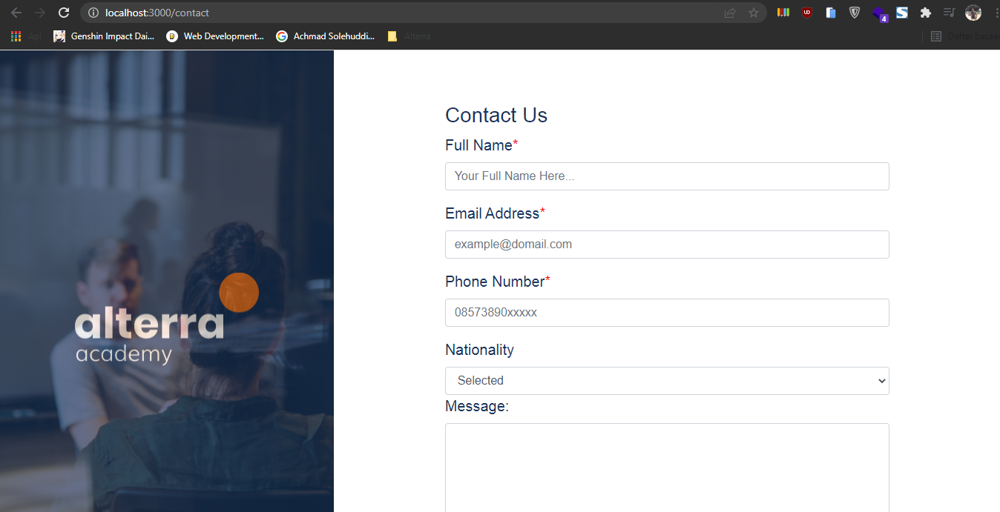

# 10 Introduction React

## Resume

Dalam materi ini dipelajari:

1. Apa itu React dan Kenapa Menggunakannya
2. Virtual-DOM
3. Set Up React Development Environment

### Apa itu React dan Kenapa Menggunakannya

React adalah library Javascript yang berfungsi untuk membuat user interface (UI) baik itu pada web ataupun mobile. React bersifat open source dan dimaintain oleh Facebook. Karena react hanya digunakan untuk membuat user interface (UI) saja, maka dalam pengembangan software yang menggunakan arsitektur MVC (Model - View - Controller), React hanya bertugas di view saja.

React memiliki beberapa keunggulan, yaitu.

1. Memiliki pendekatan yang deklaratif.
2. Berbasis komponen, sehingga apabila perlu suatu komponen maka hanya tinggal memanggilnya saja.
3. Belajar sekali, tulis dimana saja, React bisa digunakan untuk membuat user interface website maupun mobile.
4. Sudah teruji, banyak website yang menggunakan react, seperti facebook, netflix dan masih banyak lagi.
5. Populer, menurut npmtrends, react merupakan teknologi front end yang paling populer jika dibandingkan dengan angular dan vue js. Maka dari itu, tidak perlu khawatir karena react sudah pasti memiliki komunitas yang besar.

### Virtual-DOM

DOM bisa disebutkan sebagai "heart of the modern, interactive web". Karena DOM bisa digunakan untuk hal tersebut, akan tetapi memanipulasi DOM secara manual memiliki berbagai kekurangan yaitu codenya berantakan, sulit untuk mengingat DOM state yang sebelumnya dan jauh lebih lambat dari operasi javascript pada umumnya. Maka dari itu, dalam react ada sesuatu yang dinamakan Virtual DOM. Virtual DOM merupakan representasi user interface dalam sebuah object yang disimpan dalam memory.

### Set Up React Development Environment

Dalam menyiapkan environment untuk membuat project react, ada beberapa tools yang digunakan, yaitu browser, text editor dan command line shell. Browser digunakan untuk menjalankan projectnya, text editor untuk mengedit codenya dan command line shell untuk menjalankan perintah-perintah.

Untuk membuat project react dapat menggunakan npm di command line dengan cara sebagai berikut.

```
npx create-react-app [nama-project]
```

Untuk dokumentasi mengenai react lebih lanjut dapat diakses di https://reactjs.org/

## Praktikum

Pada praktikum ini melakukan perubahan kode HTML ke JS untuk dijalankan di React. Dalam project ini menggunakan react router untuk membuat linknya. Dalam praktikum ini, ada 2 page yang dibuat, yaitu home dan contact_us. Berikut file codenya.

[Home](./praktikum/introduction-react/src/Home.js)

[Contact Us](./praktikum/introduction-react/src/Contact_Us.js)

Berikut adalah output page tersebut yang dijalankan dengan react.

### Home


### Contact Us


