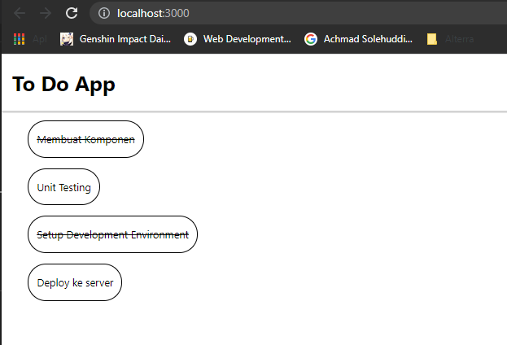

# 11 React Fundamental

## Resume

Dalam materi ini dipelajari:

1. JSX
2. React Component dan Styling
3. React Lifecycle dan Struktur Project React

### JSX

JSX merupakan singkatan dari Javascript XML. JSX merupakan ekstensi syntax pada javascript yang biasa digunakan dalam React. Penggunaan JSX dalam react sangat memudahkan karena JSX lebih menggambarkan "elemen" yang akan dibuat dalam user interface pada React. JSX memiliki syntax yang sangat mirip dengan HTML, hanya ada beberapa perbedaan, seperti penulisan class dan for.

### React Component dan Styling

React component adalah bagian kode pada suatu bagian user interface yang dapat digunakan kembali. React component digunakan untuk menentukan tampilan, behavior ataupun state yang ada di user interface. Biasanya dalam React suatu page terbagi menjadi beberapa komponen contohnya seperti navbar, button, card dan masih banyak lagi. Dalam membuat class ada 2 cara, yaitu dengan menggunakan function ataupun class. Berikut adalah contoh kodenya.

```
<!-- Class component -->
class Header extends React.Component {
    render(){
        return (
            <!-- JSX -->
        )
    }
}

export default Header;

<!-- Function component -->
export default function Header(){
    return (
            <!-- JSX -->
    )
}
```

Dalam pembuatan React component, dapat mengirimkan data berupa variabel ataupun object. Data yang dikirim tersebut akan masuk ke dalam props. Selain itu, dalam kode JSX juga bisa membuat component berdasarkan condition, bisa menggunakan if else ataupun ternary operator.

Dalam memberikan styling pada React, dapat digunakan beberapa cara yaitu menggunakan className, attribut style dan modul CSS. Untuk modul css hanya perlu memberikan nama cssnya menjadi [nama-component].module.css

### React Lifecycle dan Struktur Project React

React lifecycle adalah siklus dimana suatu component react dibuat sampai dengan component tersebut mati atau dihilangkan. Ada 3 tahapan dalam react lifecycle, yaitu mounting, updating dan unmounting. Pada saat mounting component dibuat. Selanjutnya pada saat updating disitu terjadi update pada componentnya selanjutnya pada saat unmounting component dihilangkan. Dalam react lifecycle ada 3 fase yaitu fase rendering, fase precommit dan fase commit.

Dalam membuat project react, ada beberapa pendekatan dalam membuat struktur projectnya. Pendekatan tersebut yaitu.

1. Pengelompokkan folder berdasarkan fitur atau rute
2. Pengelompokkan folder berdasarkan jenis file
3. Pengelompokkan folder berdasarkan kegunaan component

## Praktikum

Pada praktikum ini dilakukan pembuatan website todolist menggunakan React berdasarkan data object yang sudah disediakan di soal. Ada beberapa component yang dibuat dalam website ini, yaitu Header, ListCard dan TodoList.

Pada tampilan todolistnya apabila nilai data completednya true maka akan dicoret sedangkan false tidak, untuk membuat hal tersebut digunakan rendering component dengan condition ternary operator. Berikut ini adalah kodenya.

[Header](./praktikum/todolist/src/pages/TodoList/components/Header.jsx)
[ListCard](./praktikum/todolist/src/pages/TodoList/components/ListCard.jsx)
[TodoList](./praktikum/todolist/src/pages/TodoList/TodoList.jsx)

Untuk data yang digunakan disimpan dalam file yang bernama [dataList.js](./praktikum/todolist/src/dataList.js).

Berikut adalah output yang dihasilkan.


