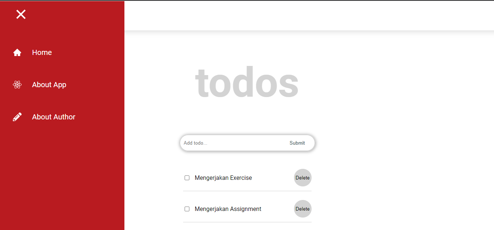
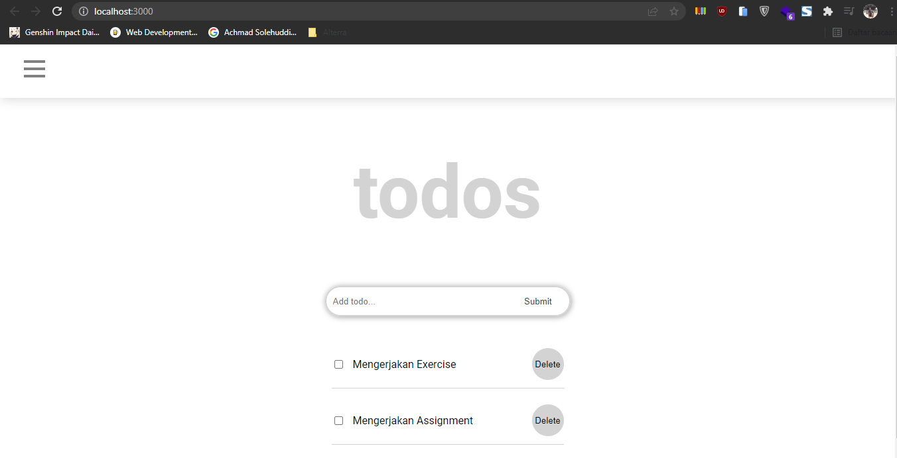
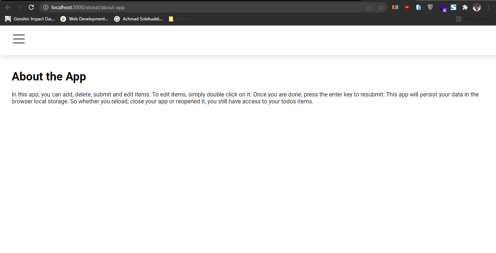
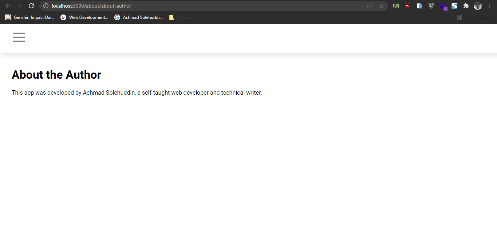
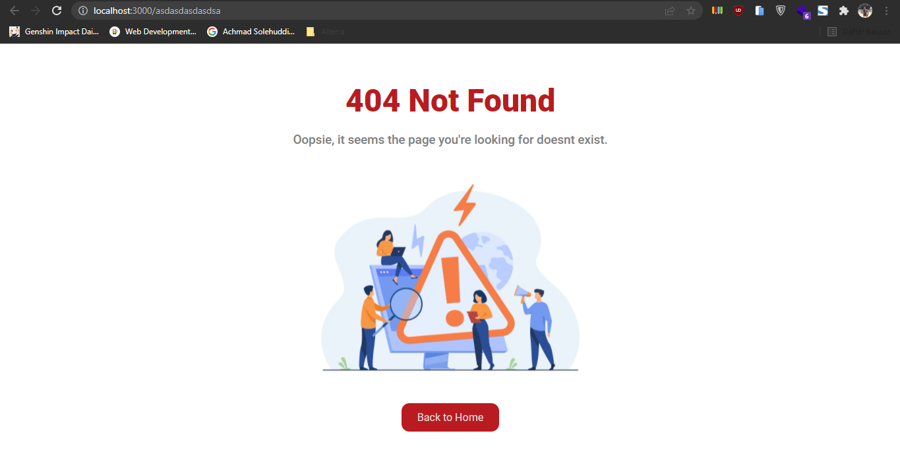

# 12 React Routing

## Resume

Dalam materi ini dipelajari:

1. Router
2. URL Param React
3. Hook Routing React

### Router

Router merupakan modul react yang berfungsi untuk melakukan navigasi page pada single page application. Single page application merupakan salah satu jenis website yang hanya menggunakan satu page untuk melakukan seluruh proses aktivitas yang ada di dalamnya.

Dalam modul react router ada beberapa fungsi yang dapat digunakan seperti BrowserRouter, Route, Switch dan Link. Namun, untuk fungsi switch hanya ada pada react router versi 5, sedangkan pada saat ini sudah ada react router versi 6, Pada versi 6 Switch diganti dengan Routes. Masing-masing fungsi tersebut memiliki kegunaan, yaitu untuk route dapat digunakan untuk menentukan pathnya, switch untuk membungkus route, sedangkan link berfungsi untuk membuat elemen yang digunakan dalam berpindah page.

### URL Parameter React

URL parameter adalah sebuah parameter nilai pada URL yang isinya dinamis. Parameter dituliskan dengan tanda titik dua. Contohnya adalah sebagai berikut.

```
<Route path="/profile/:id" component={Component}>
```

Dalam membuat website, url parameter dapat digunakan untuk beberapa hal yaitu paginasi, penyortiran dan penyaringan, pencarian dan menggambarkan.

### Hook Routing React

Dalam hook routing pada react, ada beberapa fungsi yang bisa digunakan, yaitu useHistory, useLocation, useParams, useRouteMatch.

1. useHistory, digunakan untuk mengakses instance riwayat atau history.
2. useLocation, digunakan untuk mengambil objek yang mewakili URL saat ini.
3. useParams, digunakan untuk mengakses parameter di URL.
4. useRouteMatch, digunakan untuk mencocokan URL.

## Praktikum

Pada praktikum ini dilakukan pembuatan route dengan menggunakan react router dom, berikut filenya.

[App](./praktikum/react-routing/src/App.js)

### 1. Membuat Navbar dan home dengan link "/" dan about dengan "/about"

Berikut ini adalah codenya.

[Navbar](./praktikum/react-routing/src/component/Navbar.jsx)
[Home](./praktikum/react-routing/src/pages/Home/Home.jsx)

berikut ini adalah outputnya

#### Navbar



#### Home



### 2. Membuat page about app dan about author sebagai tambahan dari URL "/about"

Berikut ini adalah codenya.

[about-app](./praktikum/react-routing/src/pages/About/AboutApp.jsx)
[about-author](./praktikum/react-routing/src/pages/About/AboutAuthor.jsx)

berikut ini adalah outputnya

#### About App



#### About Author



### 3. Membuat page not found jika path tidak ditemukan

Berikut ini adalah codenya.

[page not found](./praktikum/react-routing/src/pages/NotFound/NotFound.jsx)

berikut ini adalah outputnya


