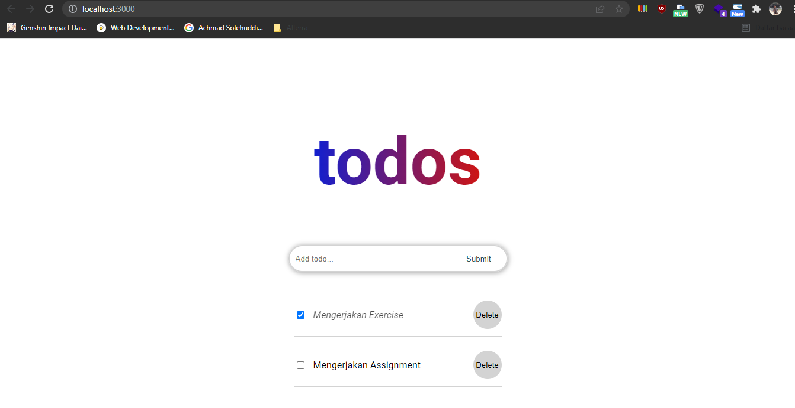
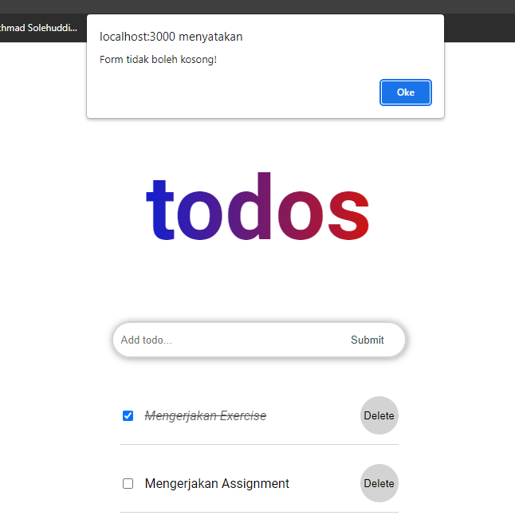

# 12 Event Handling

## Resume

Dalam materi ini dipelajari:

1. State
2. Stateful & Stateless Component
3. Event Handling in React

### State

State adalah sebuah data private yang ada di dalam sebuah component. State hanya bisa diakses oleh component yang memilikinya dan tidak bisa diakses oleh component lain. State memiliki perbendaan dengan props. State bersifat dinamis sedangkan props statis. Untuk membuat state di dalam component caranya bisa menggunakan `this.state` untuk component class. Untuk memodifikasi state digunakan `this.setState()`.

### Stateful & Stateless Component

Stateful component adalah sebuah component yang memiliki state. Umumnya menggunakan class component. Sedangkan stateless component adalah component yang hanya memiliki props, umumnya menggunakan function.

Stateful component bertujuan sebagai component yang bisa digunakan untuk berinteraksi dengan aplikasi. Sedangkan stateful component hanya untuk visualisasi saja.

### Event Handling in React

Event handling adalah sebuah metode yang digunakan untuk menangani aksi yang diberikan user ke component. Sedangkan event adalah sebuah aksi yang dilakukan oleh user, contohnya click button.

Ada beberapa jenis event yaitu clipboard events, form events, mouse events dan generic events.

## Praktikum

Pada praktikum ini dilakukan pembuatan todolist dengan memanfaatkan event handling.

[App](./praktikum/event-handling/src/App.js)

Output dari aplikasi ini adalah sebagai berikut.

Dalam aplikasi ini ada 3 component, yaitu Home, ListItem dan InputForm. Berikut ini adalah codenya.

[Home](./praktikum/event-handling/src/components/Home.jsx)
[InputForm](./praktikum/event-handling/src/components/InputForm.jsx)
[ListItem](./praktikum/event-handling/src/components/ListItem.jsx)

Aplikasi ini bisa digunakan untuk:

1. Mengisi todolist dengan menggunakan input form,
2. Menentukan pekerjaan telah selesai atau belum dengan checklist,
3. Menghapus todolist,
4. Mengeluarkan alert apabila form yang disubmit kosong.

Berikut ini adalah alertnya.

