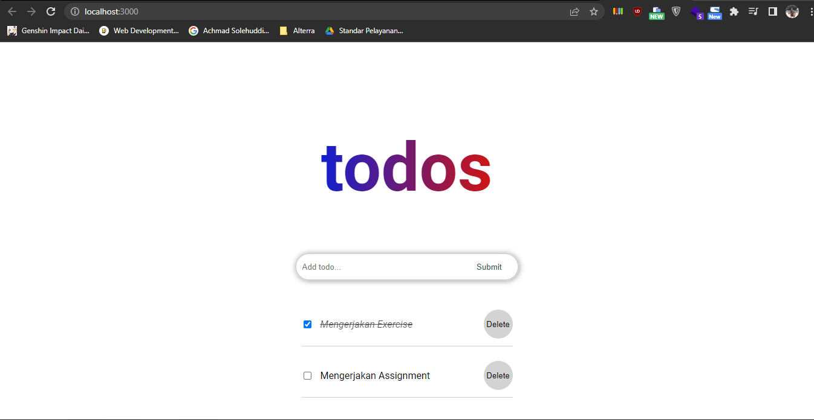

# 14 React Hooks

## Resume

Dalam materi ini dipelajari:

1. React Hooks
2. useState dan useEffect
3. Custom Hooks

### React Hooks

React hooks merupakan fitur baru pada React 16.8. Hooks memberikan fitur baru yang bisa digunakan pada function component, yaitu function component dapat menggunakan state. Sebelumnya, hanya class component yang bisa menggunakan state.

Hooks digunakan dengan beberapa motivasi yaitu class membingungkan manusia dan mesin, komponen yang kompleks menjadi sulit dimengerti dan sulitnya penggunaan kembali stateful logic antar komponen. Dalam penggunaannya hooks memiliki aturan yaitu harus dipanggil di tingkat atas, jadi hooks tidak boleh dipanggil dalam loops, condition atau nested function. Kedua, hanya memanggil hooks denfan fungsi-fungsi react.

### useState dan useEffect

useState adalah fungsi pada hooks untuk membuat sebuah state. Cara membuat state dengan hooks adalah menggunakan destructuring array sebagai berikut `const [count, setCount] = useState(0)`. count adalah variabel statenya, sedangkan setCount adalah function yang digunakan untuk mengganti value dari state tersebut.

useEffect adalah fungsi pada hook yang memungkinkan kita melakukan side effects dalam suatu function component. useEffect memungkinkan untuk melisten perubahan yang terjadi di dalam component. useEffect memiliki fungsi yang sama dengan react lifecycle pada class component, seperti componentDidMount, componentDidUpdate, componentWillUnmount.

### Custom Hooks

Custom hooks adalah hooks yang kita buat sendiri. Custom hooks memungkinkan kita untuk menggunakan kembali hooks tersebut di component lain. Jadi, dengan custom hooks kita bisa membuat hooks yang bisa digunakan berkali-kali.

## Praktikum

Pada praktikum ini melakukan perubahan class component menjadi function component. Selain itu juga mengubah state dengan hooks. Selain itu, dilakukan juga perubahan method menjadi function expression. Berikut ini adalah kodenya.

[App](./praktikum/react-hooks/src/App.js)

Dalam aplikasi ini ada 3 component, yaitu Home, ListItem dan InputForm. Berikut ini adalah codenya.
[Home](./praktikum/react-hooks/src/components/Home.jsx)
[InputForm](./praktikum/react-hooks/src/components/InputForm.jsx)
[ListItem](./praktikum/react-hooks/src/components/ListItem.jsx)

Output dari aplikasi ini adalah sebagai berikut.

