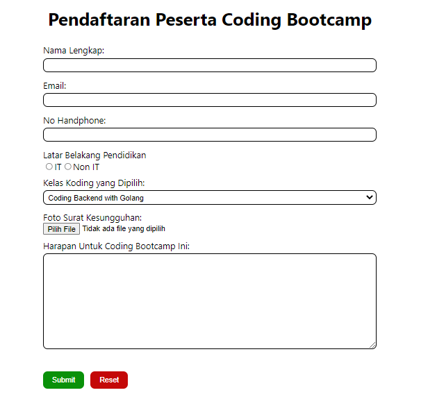
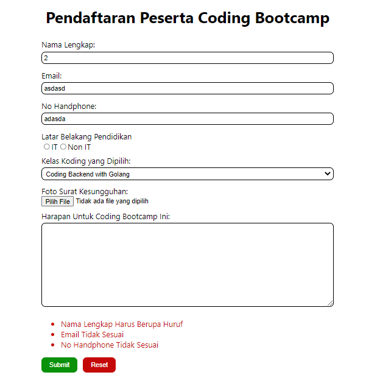
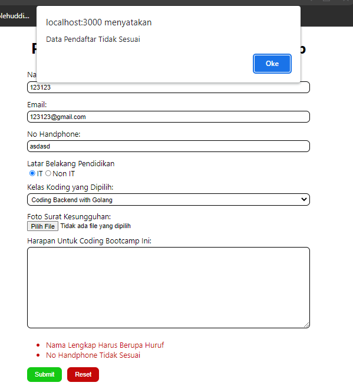
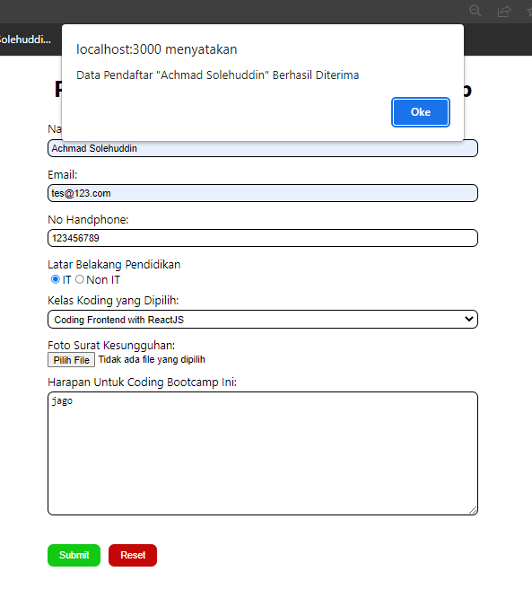

# 15 React Forms

## Resume

Dalam materi ini dipelajari:

1. Basic Form
2. Controlled Component dan Uncontrolled Component
3. Basic Validation

### Basic Form

Form adalah sebuah hal yang krusial dalam pengembangan aplikasi website. Form digunakan untuk memberikan input dari user. Form bisa digunakan dalam banyak hal, seperti login, register dan masih banyak lagi.

Form memilik berbagai macam jenis, seperti input text, radiobutton, checkbox, select, textarea, date dan masih banyak lagi.

### Controlled Component dan Uncontrolled Component

Controlled component merupakan sebuah component yang nilainya dicontrol oleh React menggunakan event handler. Sedangkan uncontrolled component adalah sebuah component yang nilainya dicontrol oleh DOMnya sendiri, apabila controlled component menggunakan event handler, maka uncontrolled component menggunakan ref untuk mendapatkan nilainya. Uncontrolled component harus menginisialisasi nilai refnya terlebih dahulu dengan menggunakan `useRef`.

Controlled dan uncontrolled component memiliki kelebihan dan kekurangannya masing-masing. Dengan controlled component, form yang telah dibuat dapat dikostumisasi sesuai dengan yang kita mau, namun apabila formnya semakin complex, maka handle yang harus dibuat akan semakin banyak. Sedangkan uncontrolled component tidak fleksibel namun lebih simpel.

### Basic Validation

Dalam membuat form, perlu adanya validasi. Validasi diperlukan untuk memastikan bahwa input sudah benar dan sesuai format, melindungi akun pengguna dengan validasi password dan melindungi sistem/aplikasinya dari celah-celah yang bisa disusupi peretas.

Ada beberapa macam jenis validasi, yaitu.

1. Client-side validation, adalah validasi yang dilakukan tanpa perlu mengirim data ke server. Kelebihan dari validasi ini adalah lebih user friendly karena bisa instant field validation.
2. Server-side validation, adalah validasi yang dilakukan dengan mengirimkan data terlebih dahulu ke server sebelum diinput ke database, lalu server akan merespon jika ada error.

## Praktikum

Pada praktikum ini membuat formulir input yang berjudul "Pendaftaran Peserta Coding Bootcamp". Pada form ini terdapat validasi, error message, alert berhasil dan error. Berikut ini adalah codenya.

[App](./praktikum/react-form/src/App.js)

Berikut ini adalah outputnya.

Dalam form ini ada 3 validasi, yaitu

1. Nama harus berupa huruf,
2. Email harus sesuai format email,
3. No handphone harus berupa nomor.

Jika syarat tersebut tidak dipenuhi, maka akan timbul error message. Berikut errornya.

Jika masih ada error lalu ditekan submit, maka akan ada alert error seperti berikut

Jika sudah benar semua, maka akan ada alert berhasil seperti berikut.

