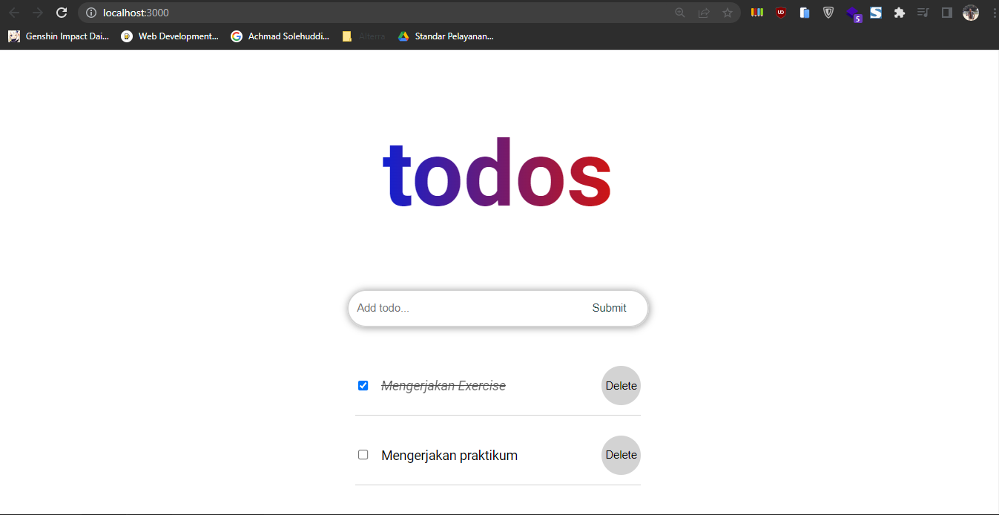
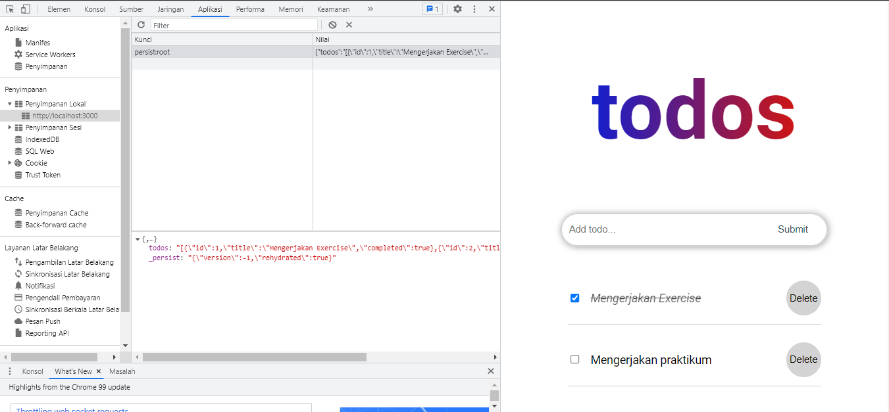

# 16 Global State Management and Data Fetching

## Resume

Dalam materi ini dipelajari:

1. Global State Management (React Redux)
2. Redux Thunk dan Persisted State
3. Data Fetching

### Global State Management (React Redux)

Global state adalah sebuah state yang bisa digunakan oleh semua component. Salah satu liberary global state management dalam react adalah React Redux. React redux dapat digunakan pada saat ada banyak state yang perlu ditaruh di banyak tempat, statenya sering berubah, ukuran codebase yang besar dan dikerjakan banyak orang serta ketika perlu untuk mengetahui bagaimana state diupdate seiring dengan waktu. Ada 3 library yang biasa digunakan dalam react redux, yaitu react-redux, redux toolkit dan redux devtools extension.

Dalam react redux, ada 3 komponen yang biasa digunakan yaitu.

1. Action, berfungsi untuk memberikan informasi dari aplikasi ke store.
2. Reducer, berfungsi sebagai function yang mengambil state dan object action, mengolahnya dan mengembalikan state terbarunya.
3. Store, berfungsi sebagai objek sentral yang menyimpan state pada aplikasi.

### Redux Thunk dan Persisted State

#### Redux Thunk

Redux Thunk adalah sebuah middleware yang memungkinkan kita untuk membuat action creater yang mengembalikan function. Redux Thunk digunakan untuk menghandle side effect yang kompleks seperti logic synchronous yang perlu akses ke store dan logic async seperti fetch data. untuk menginstall redux thunk dapat menggunakan npm dengan cara `npm install redux-thunk`. Dokumentasi redux thunk tersedia di github.com/reduxjs/redux-thunk.

#### Persisted State

Persisted State adalah sebuah state yang disimpan di local storage. Salah satu library pada react yang dapat membantu hal tersebut adalah redux-persist. Untuk menginstall redux persist dapat menggunakan npm dengan cara `npm install redux-persist`.

Ada beberapa hal yang harus disetup terlebih dahulu sebelum menggunakan redux-persist, yaitu persistConfig, persistReducer dan persistor. Untuk menggunakannya dapat memberikan tag PersistGate pada index.js reactnya.

```
<PersistGate loading={null} persistor={persistor}>
    <RootComponent />
</PersistGate>
```

### Data Fetching

Data fetching adalah salah satu hal yang pasti dilakukan oleh sebuah aplikasi. Dalam proses ini dilakukan permintaan data, edit dan penyimpanannya. Biasanya, data yang request adalah data dari API. Untuk mengambil atau fetching data dari API pada javascript menggunakan method `fetch`.

Dalam fetching data, ada beberapa method yang digunakan, yaitu.

1. GET, digunakan untuk mengambil data.
2. POST, digunakan untuk input.
3. PUT, digunakan untuk update.
4. DELETE, digunakan untuk delete.

## Praktikum

Pada praktikum ini memodifikasi task sebelumnya (todo list) dengan menggunakan global state dan persist state. Ada beberapa file baru yang dibuat, yaitu store dan todoSlice berikut ini adalah codenya.

[store.js](./praktikum/global-state/src/store/store.js)
[todoSlice.js](./praktikum/global-state/src/store/todoSlice.js)

Selain itu, digunakan juga useDispatch dan useSelector pada component InputForm dan ListItem.
[InputForm.jsx](./praktikum/global-state/src/components/InputForm.jsx)
[ListItem.jsx](./praktikum/global-state/src/components/ListItem.jsx)

Berikut ini adalah outputnya.


Aplikasi ini menggunakan persist state, yaitu menyimpan statenya pada local storage. Berikut ini adalah statenya.


