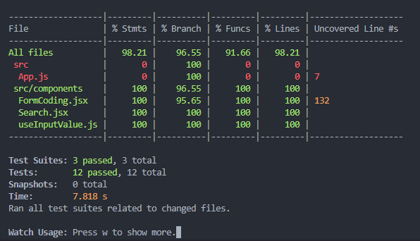

# 17 Testing

## Resume

Dalam materi ini dipelajari:

1. Testing Introduction
2. React Testing Library (RTL)
3. Testing Custom Hook

### Testing Introduction

Testing adalah proses verifikasi untuk memastikan bahwa kode kita sudah bebas benar. Testing dilakukan dengan test assertions yang mengembalikan nilai true atau false. Dalam react library yang bisa digunakan untuk melakukan testing adalah react testing library dengan jest.

Testing ada dua kategori, yaitu:

1. Testing rendering component, testing yang dilakukan pada environment testing.
2. Testing end-to-end, testing ini dilakukan langsung di browser.

### React Testing Library (RTL)

React testing library (RTL) adalah library yang bisa digunakan untuk melakukan testing pada React. Untuk menjalankan testing pada react bisa menggunakan command `npm test`, namun bisa juga menggunakan `npm run test --coverage` untuk mendapatkan laporan coveragenya. Laporan coverage sendiri berisi persentase cakupan code kita yang sudah ditesting.

Dalam melakukan testing ada 4 tahapan yang biasanya dilakukan yaitu,

1. Render componentnya,
2. Pilih elemen yang akan dilakukan testing,
3. Lakukan pemanggilan event (bisa dengan fireEvent),
4. Expect sebuah value yang dihasilkan.

### Testing Custom Hook

Untuk melakukan testing custom hook, bisa digunakan library `@testing-library/react-hooks`. Biasanya ada 3 hal yang dilakukan testing pada custom hook, yaitu.

1. Testing Value
2. Testing Callback
3. Testing Re-render

Dalam testing hook, ada beberapa function yang bisa digunakan seperti renderHook untuk memanggil hooknya, act untuk memanggil callback dan rerender untuk melakukan rerender.

## Praktikum

Pada praktikum ini melakukan testing pada 3 file, yaitu form, testing API dan testing custom Hook. Berikut adalah filenya.

[FormCoding.jsx](./praktikum/testing/src/components/FormCoding.jsx)
[FormCoding.test.js](./praktikum/testing/src/components/__test__/FormCoding.test.js)

[Search.jsx](./praktikum/testing/src/components/Search.jsx)
[Search.test.js](./praktikum/testing/src/components/__test__/Search.test.js)

[useInputValue.js](./praktikum/testing/src/components/useInputValue.js)
[useInputValue.test.js](./praktikum/testing/src/components/__test__/useInputValue.test.js)

Berikut ini adalah hasil output coveragenya.

