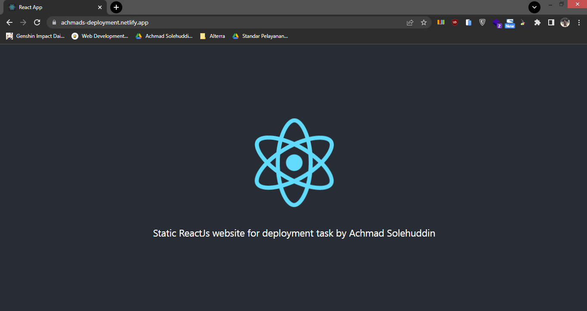

# 17 Testing

## Resume

Dalam materi ini dipelajari:

1. Build React App
2. Deployment
3. Netlify

### Build React App

Build react app dilakukan untuk membuat file react yang siap di production. Hal ini disebabkan pada file react yang aslinya terdapat pesan-pesan error yang menyebabkan lambatnya performa. Dalam melakukan build react app bisa digunakan command `npm run build`. Nantinya file hasil buildnya ada di folder build.

Untuk menjalankan file hasil build, dapat digunakan serve. Caranya adalah install dahulu servenya dengan `npm install -g serve`. Lalu untuk menjalanknya bisa menggunakan command `serve -s build`.

### Deployment

Deployment adalah kegiatan yang dilakukan untuk menyebarkan aplikasi yang telah kita buat supaya bisa diakses oleh banyak orang. Dalam melakukan deployment untuk website statis ada banyak service yang menyediakannya. Beberapa contohnya adalah netlify, vercel dan surge.

### Netlify

Netlify adalah layanan penyedia deployment bagi website. Ada beberapa cara yang bisa dilakukan untuk melakukan deploy pada netlify. Caranya adalah dengan menggunakan netlify CLI atau dengan menghubungkan repo github dengan netlify.

Untuk deploy dengan netlify CLI, caranya adalah install terlebih dahulu netlify CLI nya dengan `npm install netlify-cli -g`. Lalu lakukan perintah netlify deploy, selanjutnya ada autentikasi akun netlify dan selanjutnya ada pilihan untuk create new site. Diakhiri dengan memilih lokasi file yang akan dideploy yaitu folder build.

## Praktikum

Pada praktikum ini melakukan deployment pada website react statis dengan menggunakan netlify CLI. Hasil deploynya dapat diakses di https://achmads-deployment.netlify.app/.

Berikut ini adalah hasil output deploymentnya.

