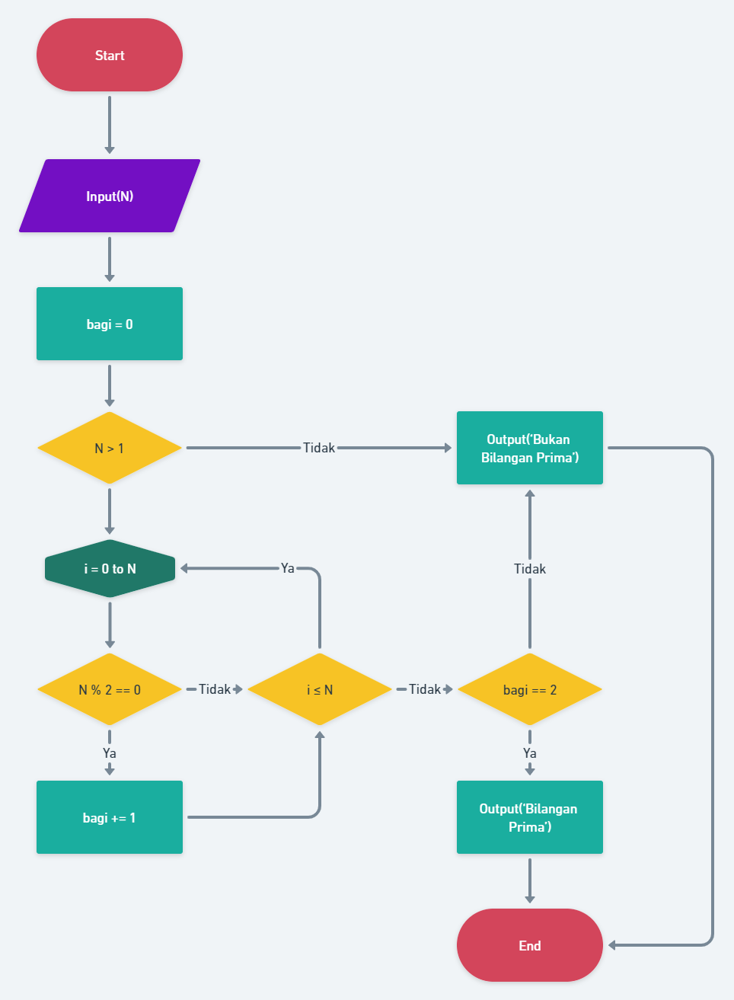
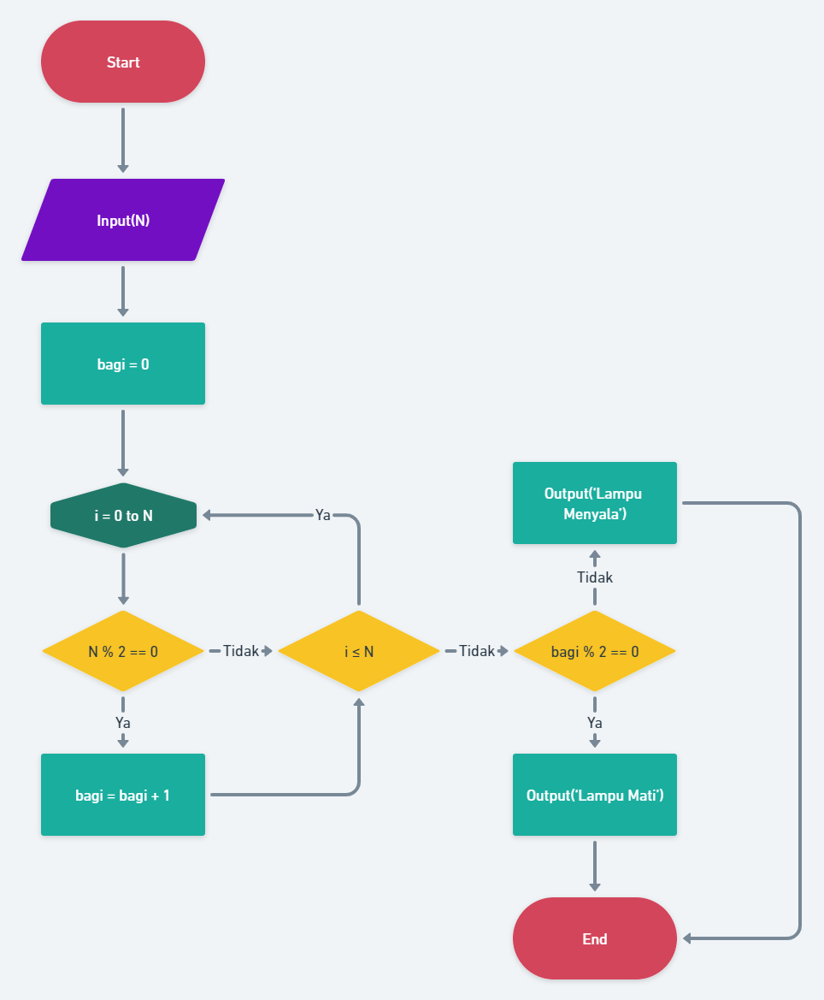

# 19 Introduction Algorithm

## Resume

Dalam materi ini dipelajari:

1. Algoritma
2. Pseudocode
3. Flowchart

### Algoritma

Algoritma adalah sebuah prosedur komputasi yang memiliki nilai input dan menghasilkan output. Algoritma juga bisa dikatakan sebagai langkah-langkah sistematis untuk melakukan sesuatu. Salah satu penggunaan algoritma adalah pada sorting, searching dan masih banyak lagi.

Algoritma memiliki 3 karakteristik, yaitu.

1. Memiliki awal dan akhir (batas),
2. Intruksinya terdefinisi dengan baik,
3. Efektif dan efisien.

### Pseudocode

Pseudocode adalah bahasa yang digunakan untuk mendeskripsikan langkah-langkah pada suatu algoritma. Pseudocode tidak berdasar pada bahasa pemrograman manapun.

### Flowchart

Flowchart adalah sebuah bagan dengan simbol-simbol tertentu yang menggambarkan jalannya suatu proses atau algoritma secara mendetail. Flowchart memiliki beberapa jenis simbol, yaitu.

1. Mulai / selesai, berupa oval.
2. Proses, berupa persegi panjang.
3. Input/output, berupa jajargenjang.
4. Perkondisian, berupa belah ketupat.
5. Looping, berupa hexagon.

## Praktikum

Pada praktikum ini ada dua problem, yang pertama mengecek bilangan prima dan yang kedua tentang lampu dan tombol.

### Problem 1 - Bilangan Prima

Penjelasannya:

1. Start
2. Input number (N)
3. set bagi = 0
4. Jika N > 1, maka output bukan bilangan prima
5. loop i = 0 sampai dengan N
6. Jika N habis dibagi 2 maka bagi = bagi + 1
7. Setelah loop selesai jika bagi == 2 maka merupakan bilangan prima
8. Jika tidak maka bukan bilangan prima
9. Selesai

### Problem 2 - Lampu dan Tombol

Penjelasannya:

1. Start
2. Input number (N)
3. set bagi = 0
4. loop i = 0 sampai dengan N
5. Jika N habis dibagi 2 maka bagi = bagi + 1
6. Setelah loop selesai jika bagi habis dibagi 2, maka lampu mati
7. Jika tidak, maka lampu menyala
8. Selesai
