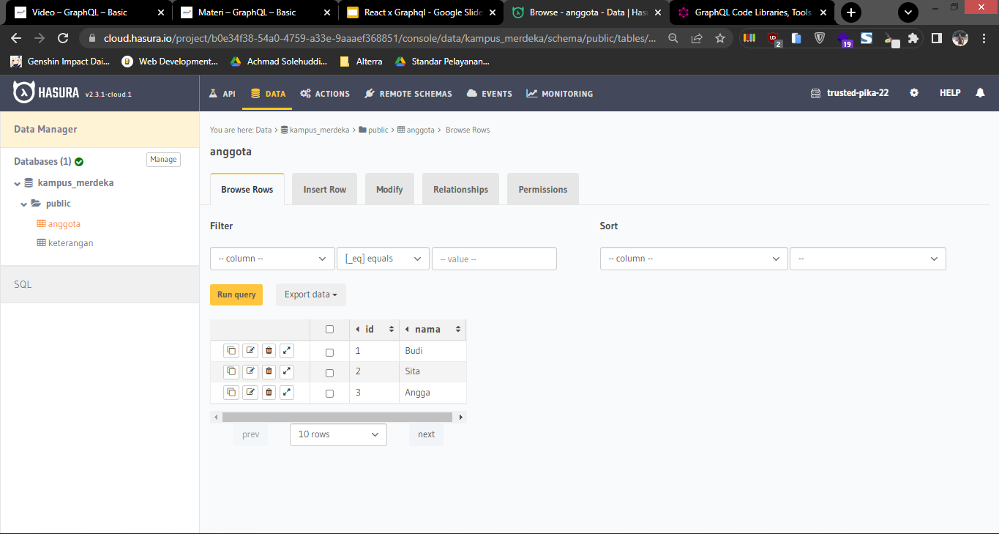
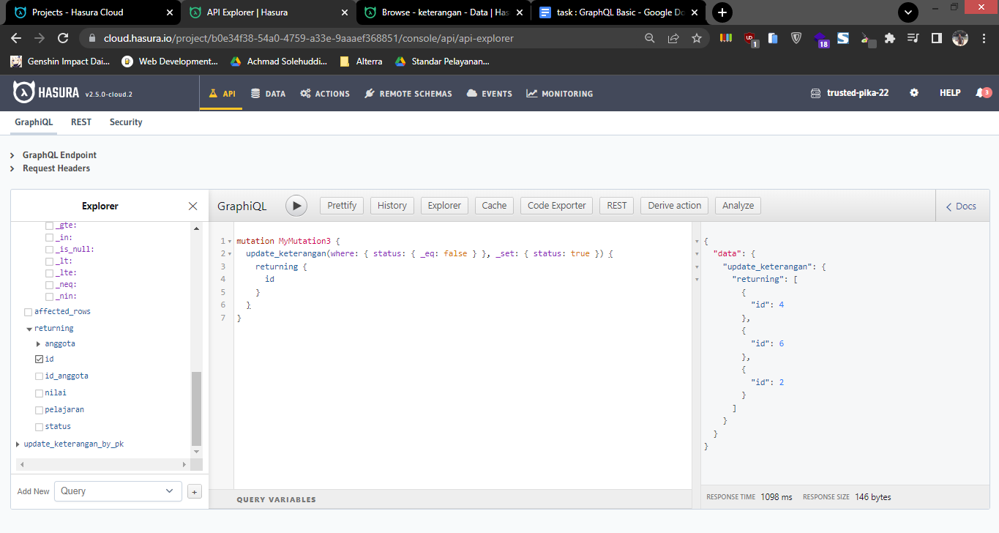

# 19 Introduction Algorithm

## Resume

Dalam materi ini dipelajari:

1. GraphQL
2. GraphQL Query
3. Heroku dan Hasura

### GraphQL

GraphQL adalah query language yang digunakan untuk API. GraphQL dapat meminimalisir data yang perlu ditransfer, artinya dengan menggunakan GraphQL kita bisa mengambil data yang kita perlukan saja. Berbeda dengan REST API, GraphQL hanya memiliki satu endpoint saja.

### GraphQL Core Feature

GraphQL client memiliki 3 fitur utama, yaitu

1. Query, digunakan untuk mengambil data berdasarkan query yang telah dibuat. Contohnya adalah sebagai berikut.

```
{
    query {
        users {
            id
            name
        }
    }
}
```

2. Mutation, digunakan untuk insert, update dan delete data. Contohnya adalah sebagai berikut.

```
{
    mutation {
        insert_user {
            objects:{
                name: "Achmad Solehuddin"
            }
        }
    }
}
```

3. Subscription, digunakan untuk mengupdate data secara realtime.

```
{
    subscription {
        user {
            id
            name
        }
    }
}
```

### Heroku dan Hasura

Hasura adalah sebuah service yang menyediakan GraphQL dan REST API. Hasura dapat diakses di https://hasura.io/

Heroku adalah sebuah service yang menyediakan cloud platform. Dapat mensupport banyak bahasa pemrograman. Selain itu Heroku juga bisa membuat database. Heroku dapat diakses di https://heroku.com/

## Praktikum

Pada praktikum ini membuat database dengan hasura dan heroku. Dengan menggunakan GraphQL juga.

Query filenya dapat dilihat di

[query.graphql](./praktikum/query.graphql)

`Catatan: dikarenakan pada soal diperintahkan querynya disimpan di file .json, namun querynya jika disimpan di json akan muncul error, maka querynya disimpan dalam bentuk string di jsonnya.`

### Tabel

Pada praktikum ini di dalam database membuat dua tabel, yaitu tabel anggota dan keterangan. Berikut tampilan tabel anggota dan keterangan.

#### 1. Tabel Anggota



#### 2. Tabel Keterangan


Selain itu, dilakukan 3 query, yaitu

### Query

#### 1. Query memanggil siswa dengan status true (No 6)

[hasilNo6.json](./praktikum/hasilNo6.json)


#### 2. Query insert data dengan mutation (No 7)

[hasilNo7.json](./praktikum/hasilNo7.json)


#### 3. Query update dengan mutation terhadap data yang false menjadi true (No 8)

[hasilNo8.json](./praktikum/hasilNo8.json)

