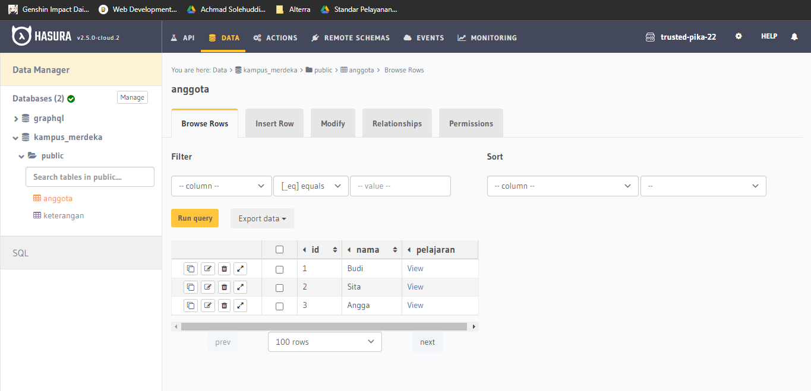
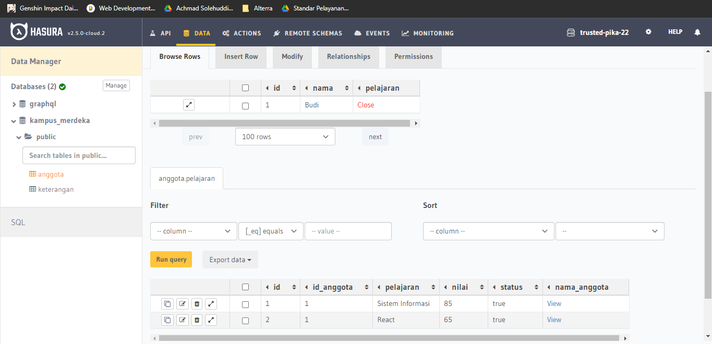
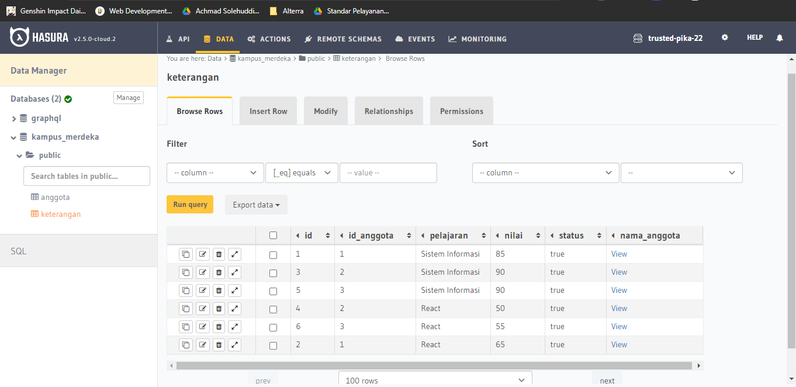
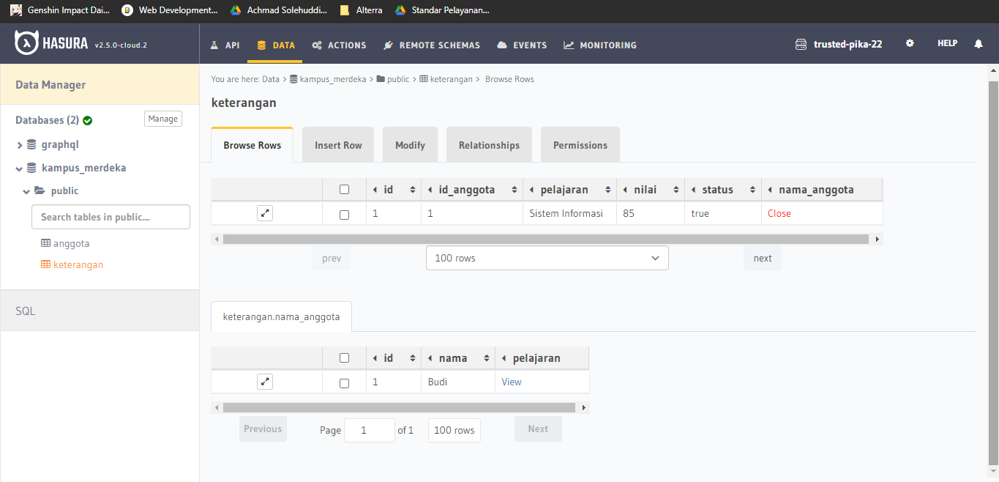

# 21 Relational Database

## Resume

Dalam materi ini dipelajari:

1. Database Relationship
2. Relational Database Management System (RDBMS)
3. Jenis Perintah SQL

### Database Relationship

Pada database, ada 3 jenis database relationship yang bisa terjadi, yaitu.

1. one-to-one, jenis relationship ini dimana salah satu entitas hanya bisa memiliki satu entitas lainnya. Contohnya adalah dalam suatu universitas, satu mahasiswa hanya bisa memiliki satu jurusan.
2. one-to-many, jenis relationship ini dimana salah satu entitas bisa memiliki banyak entitas lainnya. Namun tidak sebaliknya. Contohnya adalah satu fakultas bisa memiliki banyak mahasiswa.
3. many-to-many, jenis relationship ini dimana salah satu entitas bisa memiliki banyak entitas lainnya, begitupun sebaliknya. Contohnya adalah satu mahasiswa bisa mengambil banyak mata kuliah, satu mata kuliah bisa diambil banyak mahasiswa.

### Relational Database Management System (RDBMS)

RDMBS adalah suatu software atau tools yang dapat membantu dalam mengatur database. Contohnya adalah MySQL, postgreSQL, mongoDB dan masih banyak lagi.

### Jenis Perintah SQL

Jenis perintah SQL ada 3, yaitu.

1. DDL (Data Definition Language), jenis perintah SQL yang digunakan untuk mendefinisikan data yang akan disimpan. Data yang didefinisikan dalam hal ini adalah database ataupun tabel.
2. DML (Data Manipulation Language), jenis perintah SQL yang digunakan untuk memanipulasi data yang ada pada tabel. Perintah perintah yang tersedia ada banyak, yaitu insert, update, select dan delete.
3. DCL (Data Control Language), jenis perintah SQL yang digunakan untuk mengatur hak akses database kepada user.

## Praktikum

Pada praktikum ini membuat dua hal, yaitu.

1. Relasi one-to-one yang menghubungkan id_anggota pada tabel keterangan dengan nama di tabel anggota. Hasilnya yaitu.

   
   

2. Relasi one-to-many yang menghubungkan id pada tabel anggota dengan pelajaran pada tabel keterangan. Hasilnya yaitu.
   
   
