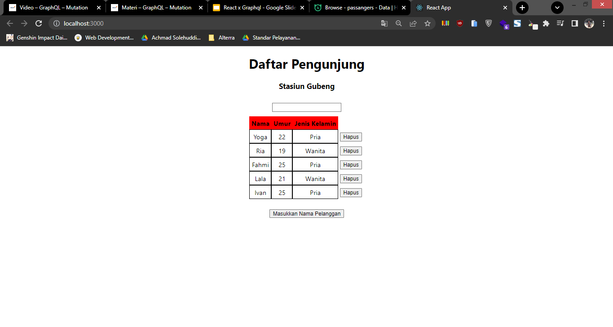
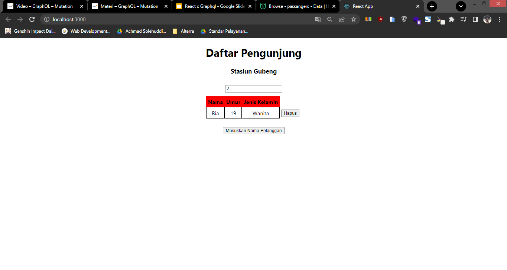

# 23 GraphQL – Query and Apollo client

## Resume

Dalam materi ini dipelajari:

1. Apollo Client

2. Set up Apollo Client

3. useQuery dan useLazyQuery

### Apollo Client

Apollo client adalah sebuah library state management javascript yang berguna untuk mengatur data local dan remote pada GraphQL. Apollo client berguna untuk melakukan fetching, cache dan modifikasi data pada aplikasi sekaligus mengupdate UInya.

Dalam apollo client berbagai macam operasi graphql seperti mutation, query dan subscription dapat dilakukan.

### Set up Apollo Client

Ada beberapa hal yang harus digunakan dalam melakukan set up apollo client, yaitu membuat object Apollo Client terlebih dahulu seperti ini.

```
import { ApolloClient, InMemoryCache } from "@apollo/client";

const client = new ApolloClient({
  uri: "https://trusted-pika-22.hasura.app/v1/graphql",
  cache: new InMemoryCache(),
  headers: {
    "x-hasura-admin-secret":
      "LdNr2bcW3L0LCEtYYqD0GI3KIx7aEobmSO88QevTQkoHraB9jK3tEMya6dBUU0ml",
  },
});

export default client;
```

Selanjutnya memberikan apollo provider pada index.js

```
import { ApolloProvider } from "@apollo/client";
import client from "./apollo-client";

ReactDOM.render(
  <ApolloProvider client={client}>
    <React.StrictMode>
      <App />
    </React.StrictMode>
  </ApolloProvider>,
  document.getElementById("root")
);
```

### Query

Dalam melakukan pemanggilan query graphql pada Apollo client bisa menggunakan fungsi gql. Selanjutnya, untuk pemanggilan datanya ada 2 custom hooks yang disediakan, yaitu useQuery dan useLazyQuery. useQuery berfungsi untuk memanggil query secara langsung, sedangkan useLazyQuery memanggil query hanya pada saat ada event tertentu. Untuk penggunaannya yaitu.

useQuery

```
const {data, loading, error} = useQuery(QUERY);
```

useLazyQuery

```
const [getQuery, {data, loading, error}] = useLazyQuery(QUERY);
```

## Praktikum

Pada praktikum ini menghubungkan aplikasi passanger list dengan database di hasura menggunakan Apollo Client. Berikut adalah source codenya.

[apollo-client.js](./praktikum/src/apollo-client.js)
[Home.js](./praktikum/src/component/Home.js)

Ada dua fitur yang dibuat pada praktikum ini, yaitu.

1. Data pada tabel akan otomatis fetching dari database ketika aplikasi di buka, berikut ini hasilnya.

   

2. Fitur search data by id
   
