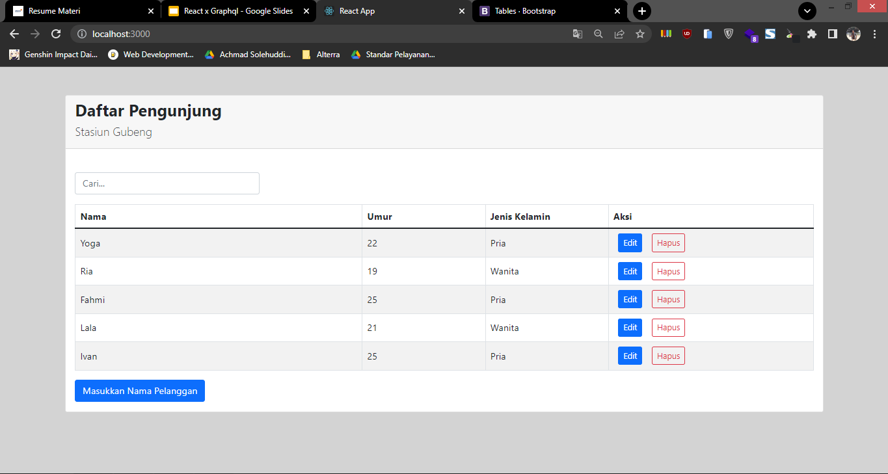
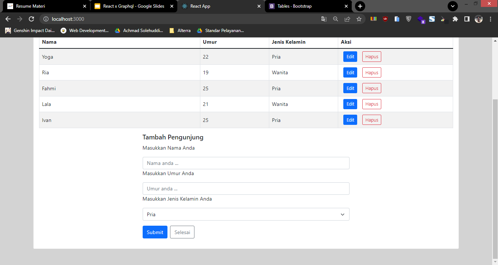
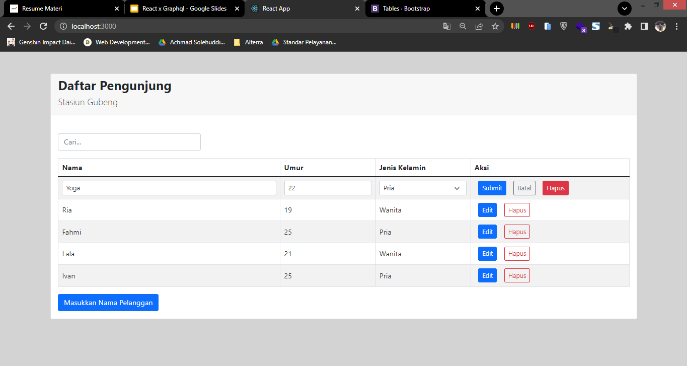

# 23 GraphQL – Mutation

## Resume

Dalam materi ini dipelajari:

1. Set up mutation with Apollo Client
2. Mutation Insert, Update and Delete Data with Apollo Client
3. refetchQueries

### Set up mutation with Apollo Client

Untuk melakukan mutation pada apollo client, dapat menggunakan custom hooks useMutation. Sebelum digunakan useMutation harus diimport dahulu dari library @apollo/client.

### Mutation Insert, Update and Delete Data with Apollo Client

Untuk dapat melakukan insert, update dan delete dengan apollo client, bisa digunakan useMutation. useMutation memiliki beberapa atribut objek yang biasa dipakai dan memiliki parameter query.

```
const [insertData, {data, loading, error}] = useMutation(QUERY_INSERT);
```

Dari kode diatas, penjelasannya adalah sebagai berikut.

1. insertData merupakan function yang akan dipakai untuk memanggil querynya.
2. data berisi return data yang dihasilkan.
3. loading berisi nilai yang akan berubah menjadi false apabila query telah selesai.
4. error berisi message yang terjadi apabila error.

Untuk melakukan pemberian variabel, caranya adalah dengan melakukan pemanggilan function berikut.

```
insertData({variables: {namaVariabel: isiVariabel}})
```

### refetchQueries

Dalam penggunaan useMutation, ada banyak option yang option yang bisa digunakan. Namun, salah satu yang penting untuk diketahui adalah refetchQueries. refetchQueries berfungsi untuk melakukan query ulang apabila mutation telah dilakukan, sehingga tidak perlu refresh page apabila ingin mengupdate data terbaru. Cara penggunaannya adalah sebagai berikut.

```
const [insertData, {data, loading, error}] = useMutation(QUERY_INSERT, {
    refetchQuries: [QUERY_GET_DATA]
});
```

## Praktikum

Pada praktikum ini melakukan pembuatan fitur submit (insert), update dan delete menggunakan mutation pada apollo client. Berikut adalah source codenya.

[index.js](./praktikum/lib/client/index.js)
[graphql.js](./praktikum/lib/client/graphql.js)
[Home.js](./praktikum/src/component/Home.js)

Outputnya adalah sebagai berikut.

### Home



### Form Insert



### Form Edit


